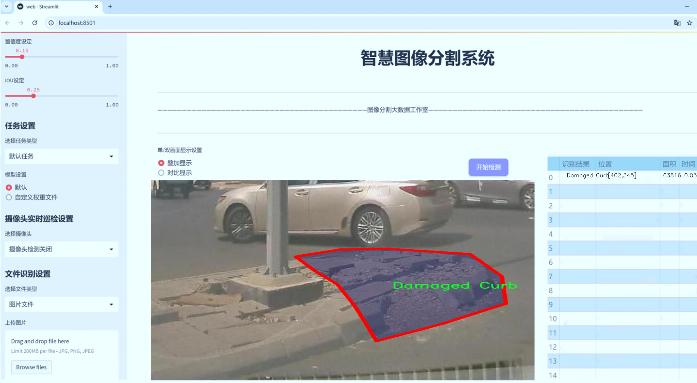
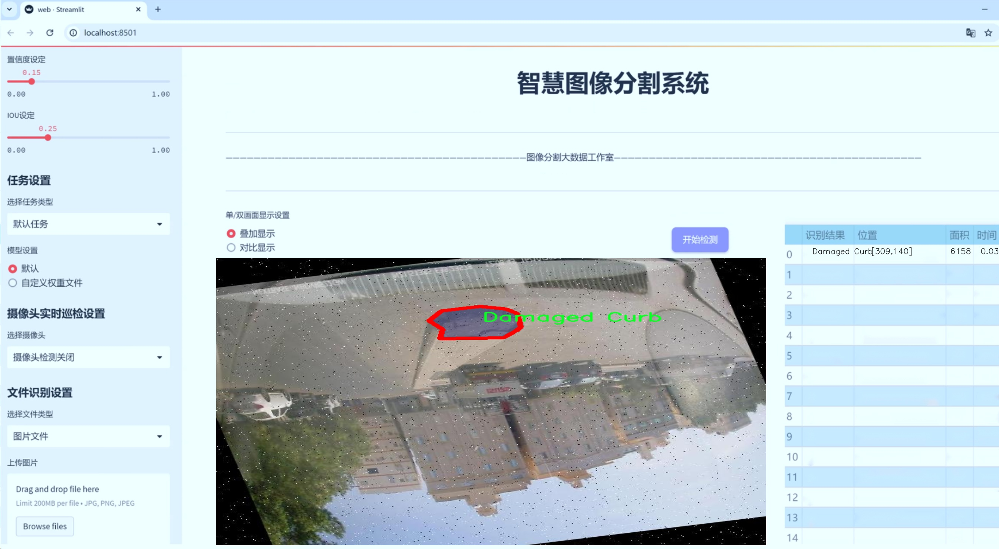
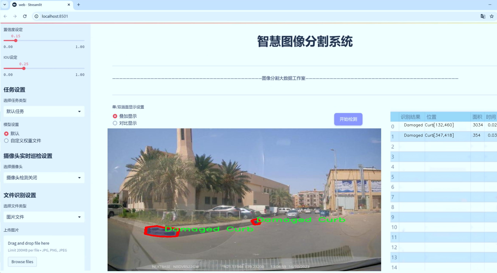
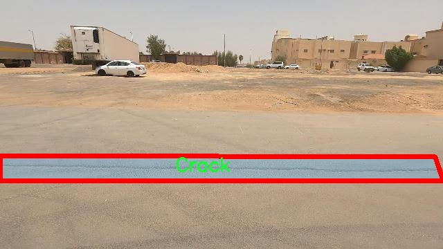
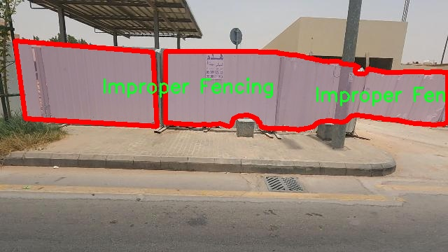
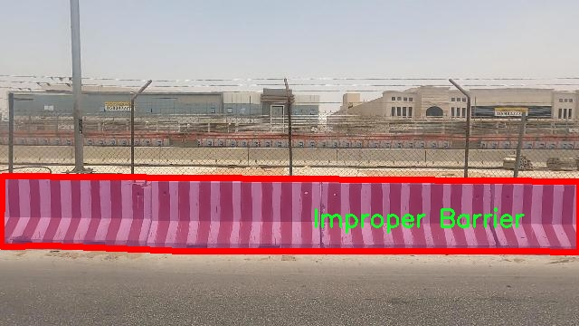
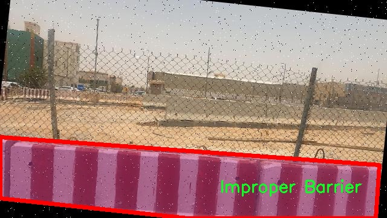
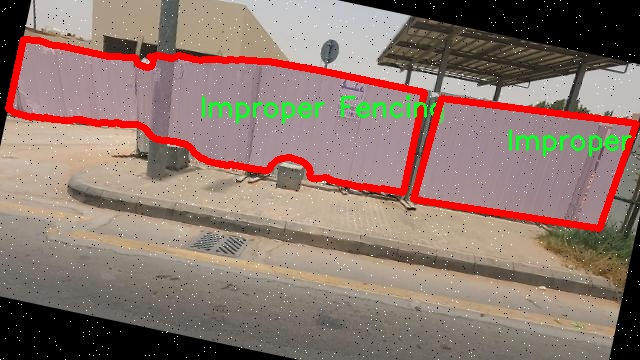

# 道路障碍物路面裂缝分割系统源码＆数据集分享
 [yolov8-seg-AFPN-P345＆yolov8-seg-C2f-EMSCP等50+全套改进创新点发刊_一键训练教程_Web前端展示]

### 1.研究背景与意义

项目参考[ILSVRC ImageNet Large Scale Visual Recognition Challenge](https://gitee.com/YOLOv8_YOLOv11_Segmentation_Studio/projects)

项目来源[AAAI Global Al lnnovation Contest](https://kdocs.cn/l/cszuIiCKVNis)

研究背景与意义

随着城市化进程的加快，城市道路的使用频率显著增加，随之而来的道路损坏问题也日益严重。道路裂缝、坑洞及其他障碍物不仅影响了交通安全，还对城市的整体形象和居民的生活质量造成了负面影响。因此，及时、准确地检测和修复道路障碍物成为了城市管理者和交通工程师面临的重要任务。传统的道路检测方法多依赖人工巡查，不仅效率低下，而且容易受到人为因素的影响，导致漏检和误检现象频繁发生。为了解决这一问题，基于计算机视觉和深度学习的自动化检测系统逐渐成为研究的热点。

在众多深度学习模型中，YOLO（You Only Look Once）系列因其高效的实时目标检测能力而受到广泛关注。YOLOv8作为该系列的最新版本，结合了更为先进的网络结构和优化算法，能够在保证检测精度的同时，实现更快的推理速度。然而，针对道路障碍物和路面裂缝的分割任务，YOLOv8的标准模型仍存在一定的局限性，尤其是在处理复杂背景和多种类障碍物时。因此，改进YOLOv8以适应道路障碍物的特定检测需求，具有重要的理论和实际意义。

本研究将基于改进的YOLOv8模型，构建一个专门针对道路障碍物和路面裂缝的分割系统。我们使用的数据集包含1800张图像，涵盖了10个类别，包括裂缝、损坏的路缘石、挖掘、不当的障碍物和围栏、未涂漆的路缘石、涂漆的路缘石、积水和坑洞等。这些类别的多样性为模型的训练提供了丰富的样本，有助于提高模型在实际应用中的泛化能力和鲁棒性。

通过对YOLOv8模型的改进，我们将引入更为精细的特征提取机制和分割策略，以提高对道路裂缝和障碍物的识别精度。此外，结合图像增强技术和迁移学习方法，可以进一步提升模型在不同环境下的适应性。最终，我们期望构建一个高效、准确的道路障碍物路面裂缝分割系统，为城市道路的维护和管理提供有力的技术支持。

本研究的意义不仅在于提升道路检测的自动化水平，更在于为城市交通管理提供科学依据，推动智能交通系统的发展。通过及时发现和修复道路问题，可以有效降低交通事故的发生率，提高城市居民的出行安全。同时，研究成果还可为其他领域的图像分割任务提供借鉴，推动深度学习技术在更广泛的应用场景中的发展。因此，本研究具有重要的学术价值和实际应用前景。

### 2.图片演示







##### 注意：由于此博客编辑较早，上面“2.图片演示”和“3.视频演示”展示的系统图片或者视频可能为老版本，新版本在老版本的基础上升级如下：（实际效果以升级的新版本为准）

  （1）适配了YOLOV8的“目标检测”模型和“实例分割”模型，通过加载相应的权重（.pt）文件即可自适应加载模型。

  （2）支持“图片识别”、“视频识别”、“摄像头实时识别”三种识别模式。

  （3）支持“图片识别”、“视频识别”、“摄像头实时识别”三种识别结果保存导出，解决手动导出（容易卡顿出现爆内存）存在的问题，识别完自动保存结果并导出到tempDir中。

  （4）支持Web前端系统中的标题、背景图等自定义修改，后面提供修改教程。

  另外本项目提供训练的数据集和训练教程,暂不提供权重文件（best.pt）,需要您按照教程进行训练后实现图片演示和Web前端界面演示的效果。

### 3.视频演示

[3.1 视频演示](https://www.bilibili.com/video/BV11gyYYnENJ/)

### 4.数据集信息展示

##### 4.1 本项目数据集详细数据（类别数＆类别名）

nc: 10
names: ['Construction Materials', 'Crack', 'Damaged Curb', 'Digging', 'Improper Barrier', 'Improper Fencing', 'Non Painted Curb', 'Painted Curb', 'Ponding Water', 'Pothole']


##### 4.2 本项目数据集信息介绍

数据集信息展示

在本研究中，我们使用了名为“clean VP project”的数据集，以支持改进YOLOv8-seg的道路障碍物路面裂缝分割系统的训练和评估。该数据集的设计旨在提供高质量的图像数据，涵盖了多种与道路维护和安全相关的障碍物类别。通过精确的标注和丰富的样本，数据集为算法的训练提供了坚实的基础，确保模型能够在实际应用中有效识别和分割不同类型的道路缺陷。

“clean VP project”数据集包含10个类别，具体包括：Construction Materials（建筑材料）、Crack（裂缝）、Damaged Curb（损坏的路缘石）、Digging（挖掘）、Improper Barrier（不当的障碍物）、Improper Fencing（不当的围栏）、Non Painted Curb（未涂漆的路缘石）、Painted Curb（涂漆的路缘石）、Ponding Water（积水）、Pothole（坑洞）。这些类别的选择反映了城市道路环境中常见的各种问题，旨在帮助自动化系统更好地理解和分析道路状况。

在数据集的构建过程中，研究团队特别注重图像的多样性和代表性，以确保所收集的样本能够覆盖不同的环境条件和光照变化。数据集中的图像来源于多种城市和乡村道路，包含了不同季节和天气条件下的道路场景。这种多样性不仅提高了模型的泛化能力，还增强了其在实际应用中的鲁棒性。

此外，数据集中的每个类别都经过精确的标注，确保了每个图像中目标的清晰可辨。这种高质量的标注为YOLOv8-seg模型的训练提供了可靠的监督信号，使得模型能够有效学习到各类障碍物的特征和边界。通过对这些类别的细致划分，模型能够在分割任务中实现更高的精度，从而在实际应用中提供更为准确的道路维护建议。

在模型训练过程中，我们采用了数据增强技术，以进一步提升模型的性能。通过对图像进行旋转、缩放、裁剪和颜色调整等操作，增加了训练样本的多样性。这一过程不仅帮助模型更好地适应不同的视觉场景，还有效减少了过拟合的风险。

综上所述，“clean VP project”数据集为改进YOLOv8-seg的道路障碍物路面裂缝分割系统提供了丰富的训练素材和高质量的标注信息。通过对该数据集的深入分析和利用，我们期望能够提升模型在道路缺陷检测中的表现，为城市交通管理和道路维护提供更为智能化的解决方案。随着技术的不断进步，未来的研究将继续探索更为先进的算法和数据集，以实现更高效的道路安全监测和维护。











### 5.全套项目环境部署视频教程（零基础手把手教学）

[5.1 环境部署教程链接（零基础手把手教学）](https://www.bilibili.com/video/BV1jG4Ve4E9t/?vd_source=bc9aec86d164b67a7004b996143742dc)


[5.2 安装Python虚拟环境创建和依赖库安装视频教程链接（零基础手把手教学）](https://www.bilibili.com/video/BV1nA4VeYEze/?vd_source=bc9aec86d164b67a7004b996143742dc)

### 6.手把手YOLOV8-seg训练视频教程（零基础小白有手就能学会）

[6.1 手把手YOLOV8-seg训练视频教程（零基础小白有手就能学会）](https://www.bilibili.com/video/BV1cA4VeYETe/?vd_source=bc9aec86d164b67a7004b996143742dc)


按照上面的训练视频教程链接加载项目提供的数据集，运行train.py即可开始训练



     Epoch   gpu_mem       box       obj       cls    labels  img_size
     1/200     0G   0.01576   0.01955  0.007536        22      1280: 100%|██████████| 849/849 [14:42<00:00,  1.04s/it]
               Class     Images     Labels          P          R     mAP@.5 mAP@.5:.95: 100%|██████████| 213/213 [01:14<00:00,  2.87it/s]
                 all       3395      17314      0.994      0.957      0.0957      0.0843

     Epoch   gpu_mem       box       obj       cls    labels  img_size
     2/200     0G   0.01578   0.01923  0.007006        22      1280: 100%|██████████| 849/849 [14:44<00:00,  1.04s/it]
               Class     Images     Labels          P          R     mAP@.5 mAP@.5:.95: 100%|██████████| 213/213 [01:12<00:00,  2.95it/s]
                 all       3395      17314      0.996      0.956      0.0957      0.0845

     Epoch   gpu_mem       box       obj       cls    labels  img_size
     3/200     0G   0.01561    0.0191  0.006895        27      1280: 100%|██████████| 849/849 [10:56<00:00,  1.29it/s]
               Class     Images     Labels          P          R     mAP@.5 mAP@.5:.95: 100%|███████   | 187/213 [00:52<00:00,  4.04it/s]
                 all       3395      17314      0.996      0.957      0.0957      0.0845


### 7.50+种全套YOLOV8-seg创新点代码加载调参视频教程（一键加载写好的改进模型的配置文件）

[7.1 50+种全套YOLOV8-seg创新点代码加载调参视频教程（一键加载写好的改进模型的配置文件）](https://www.bilibili.com/video/BV1Hw4VePEXv/?vd_source=bc9aec86d164b67a7004b996143742dc)

### 8.YOLOV8-seg图像分割算法原理

原始YOLOv8-seg算法原理

YOLOv8-seg算法是YOLO系列中最新的目标检测与分割模型，它在YOLOv8的基础上进行了进一步的优化与扩展，旨在实现更高效的目标检测和精确的图像分割。该算法的核心思想是将目标检测与实例分割结合在一起，通过一个统一的框架来处理这两项任务，从而提高模型的整体性能和应用灵活性。

YOLOv8-seg的架构依然遵循YOLO系列的设计理念，主要由输入层、主干网络、颈部网络和头部网络组成。输入层负责接收图像数据，并对其进行预处理，包括缩放和归一化，以适应模型的输入要求。此步骤确保了不同尺寸的输入图像能够被统一处理，从而提高了模型的适应性和鲁棒性。

在主干网络中，YOLOv8-seg采用了深度卷积神经网络结构，通过一系列卷积层对输入图像进行特征提取。每个卷积层后面都配备了批归一化和SiLUR激活函数，这种组合不仅加速了训练过程，还提高了模型的非线性表达能力。主干网络的设计灵感来源于YOLOv7中的E-ELAN结构，特别是C2f模块的引入，使得特征提取过程更加高效。C2f模块通过跨层分支连接，增强了模型的梯度流动性，从而改善了检测结果的准确性。

在主干网络的末尾，YOLOv8-seg引入了SPPFl模块，利用三个最大池化层来处理多尺度特征。这一设计极大地增强了网络的特征抽象能力，使得模型能够在不同尺度上捕捉到目标的细节信息。这样的多尺度特征处理对于复杂场景中的目标检测和分割至关重要，因为目标的大小和形状可能会有很大差异。

颈部网络是YOLOv8-seg的重要组成部分，它采用了特征金字塔网络（FPN）和路径聚合网络（PAN）结构，以实现不同尺度特征图的信息融合。通过这种方式，YOLOv8-seg能够有效地整合来自主干网络的多层特征，从而提高对小目标和复杂背景的检测能力。颈部网络的设计确保了信息在不同层次之间的有效传递，使得最终的检测和分割结果更加精确。

在头部网络中，YOLOv8-seg采用了解耦的检测头结构。这一结构通过两个并行的卷积分支分别计算目标的回归和分类损失，进一步提升了模型的性能。解耦头的设计使得目标检测和实例分割任务能够独立优化，从而在精度和速度上取得更好的平衡。此外，YOLOv8-seg还引入了Anchor-Free的检测方式，减少了对先验框的依赖，使得模型在处理不同形状和尺寸的目标时更加灵活。

YOLOv8-seg的损失函数采用了CloU，这是一种针对目标检测和分割任务优化的损失函数，能够有效地引导模型学习更具判别性的特征。通过对损失函数的精细设计，YOLOv8-seg在训练过程中能够更好地适应复杂的场景和多样的目标，从而提高最终的检测和分割精度。

总的来说，YOLOv8-seg算法通过深度卷积神经网络、特征金字塔网络、解耦检测头等多种先进技术的结合，构建了一个高效且精确的目标检测与分割框架。其在处理复杂场景和多样目标方面展现出了优越的性能，广泛适用于智能监控、自动驾驶、医疗影像分析等多个领域。随着YOLOv8-seg的不断发展与优化，未来的目标检测与分割任务将更加高效、准确，为各类应用场景提供强有力的技术支持。


### 9.系统功能展示（检测对象为举例，实际内容以本项目数据集为准）

图9.1.系统支持检测结果表格显示

  图9.2.系统支持置信度和IOU阈值手动调节

  图9.3.系统支持自定义加载权重文件best.pt(需要你通过步骤5中训练获得)

  图9.4.系统支持摄像头实时识别

  图9.5.系统支持图片识别

  图9.6.系统支持视频识别

  图9.7.系统支持识别结果文件自动保存

  图9.8.系统支持Excel导出检测结果数据


### 10.50+种全套YOLOV8-seg创新点原理讲解（非科班也可以轻松写刊发刊，V11版本正在科研待更新）

#### 10.1 由于篇幅限制，每个创新点的具体原理讲解就不一一展开，具体见下列网址中的创新点对应子项目的技术原理博客网址【Blog】：


[10.1 50+种全套YOLOV8-seg创新点原理讲解链接](https://gitee.com/qunmasj/good)

#### 10.2 部分改进模块原理讲解(完整的改进原理见上图和技术博客链接)【如果此小节的图加载失败可以通过CSDN或者Github搜索该博客的标题访问原始博客，原始博客图片显示正常】
### YOLOv8模型原理

YOLOv8是YOLO系列最新的模型,具有非常优秀的检测精度和速度。根据网络的深度与特征图的宽度大小, YOLOv8算法分为:YOLOv8-n、YOLOv8一s 、YOLOv8-m 、 YOLOv8-l、和 YOLOv8-x 5个版本。按照网络结构图,YOLOv8可分为: Inpul 、 Backbone , Neck和Head 4部分。


Backbone采用了CSPDarknet 架构，由CBS (标准卷积层)、C2f模块和 SPPF(金字塔池化）组成。通过5次标准卷积层和C2f模块逐步提取图像特征，并在网络末尾添加SPPF模块，将任意大小的输入图像转换成固定大小的特征向量。分别取P3、P4、P5层的特征提取结果，向Head输出80×80、40 × 40、20×20三个尺度的特征层。
C2f模块借鉴了残差网络(ResNet)以及ELAN的思想，其结构分为两个分支，主干部分利用Bottleneckm2%模块逐步加深网络，分支部分保留输入层通道并与主干部分特征进行融合，如图所示。通过标准卷积层提取新的特征层，相比于YOLOv5使用的C3模块，C2f模块可以在卷积层和全连接层之间建立一个平滑的转换，从而实现了参数的共享，提高了模型的效率和泛化能力。
Head采用了PAN-FPN 结构,将 Backbone输入的3个特征层进行多尺度融合，进行自顶向下(FAN)和自底向上 (PAN)的特征传递，对金字塔进行增强，使不同尺寸的特征图都包含强目标语义信息和强目标特征信息，保证了对不同尺寸样本的准确预测。
Detect借鉴了Decoupled-Head 思想，用一个解耦检测头将输入的不同尺寸特征层分成2个分支进行检测。第1个分支在进行3次卷积后使进行回归任务，输出预测框。第2个分支在进行3次卷积后进行分类任务，输出类别的概率。采用Varifocal_Loss2”作为损失函数，其式为:


### Context_Grided_Network(CGNet)简介
参考该博客提出的一种轻量化语义分割模型Context Grided Network(CGNet)，以满足设备的运行需要。

CGNet主要由CG块构建而成，CG块可以学习局部特征和周围环境上下文的联合特征，最后通过引入全局上下文特征进一步改善联合特征的学习。


 
下图给出了在Cityscapes数据集上对现有的一些语义分割模型的测试效果，横轴表示参数量，纵轴表示准确率(mIoU)。可以看出，在参数量较少的情况下，CGNet可以达到一个比较好的准确率。虽与高精度模型相去甚远，但在一些对精度要求不高、对实时性要求比较苛刻的情况下，很有价值。


高精度模型，如DeepLab、DFN、DenseASPP等，动不动就是几十M的参数，很难应用在移动设备上。而上图中红色的模型，相对内存占用较小，但它们的分割精度却不是很高。作者认为主要原因是，这些小网络大多遵循着分类网络的设计思路，并没有考虑语义分割任务更深层次的特点。

空间依赖性和上下文信息对提高分割精度有很大的作用。作者从该角度出发，提出了CG block，并进一步搭建了轻量级语义分割网络CGNet。CG块具有以下特点： 

学习局部特征和上下文特征的联合特征；
通过全局上下文特征改进上述联合特征；
可以贯穿应用在整个网络中，从low level（空间级别）到high level（语义级别）。不像PSPNet、DFN、DenseASPP等，只在编码阶段以后捕捉上下文特征。；
只有3个下采样，相比一般5个下采样的网络，能够更好地保留边缘信息。
CGNet遵循“深而薄”的原则设计，整个网络又51层构成。其中，为了降低计算，大量使用了channel-wise conv.

小型语义分割模型：

需要平衡准确率和系统开销
进化路线：ENet -> ICNet -> ESPNet
这些模型基本都基于分类网络设计，在分割准确率上效果并不是很好
上下文信息模型：

大多数现有模型只考虑解码阶段的上下文信息并且没有利用周围的上下文信息
注意力机制：

CG block使用全局上下文信息计算权重向量，并使用其细化局部特征和周围上下文特征的联合特征

#### Context Guided Block
CG block由4部分组成：


此外，CG block还采用了残差学习。文中提出了局部残差学习（LRL）和全局残差学习（GRL）两种方式。 LRL添加了从输入到联合特征提取器的连接，GRL添加了从输入到全局特征提取器的连接。从直观上来说，GRL比LRL更能促进网络中的信息传递（更像ResNet~~），后面实验部分也进行了测试，的确GRL更能提升分割精度。


CGNet的通用网络结构如下图所示，分为3个stage，第一个stage使用3个卷积层抽取特征，第二和第三个stage堆叠一定数量的CG block，具体个数可以根据情况调整。最后，通过1x1 conv得到分割结果。


下图是用于Cityscapes数据集的CGNet网络细节说明：输入尺寸为3*680*680；stage1连续使用了3个Conv-BN-PReLU组合，首个组合使用了stride=2的卷积，所以得到了1/2分辨率的feature map；stage2和stage3分别使用了多个CG block，且其中使用了不同大小的膨胀卷积核，最终分别得到了1/4和1/8的feature map。

需注意：

stage2&3的输入特征分别由其上一个stage的首个和最后一个block组合给出（参考上图的绿色箭头）；

输入注入机制，图中未体现，实际使用中，作者还将输入图像下采样1/4或1/8，分别给到stage2和stage3的输入中 ，以进一步加强特征传递。

channel-wise conv。为了缩减参数数量，在局部特征提取器和周围上下文特征提取器中使用了channel-wise卷积，可以消除跨通道的计算成本，同时节省内存占用。但是，没有像MobileNet等模型一样，在depth-wise卷积后面接point-wise卷积（1*1 conv），作者解释是，因为CG block需要保持局部特征和周围上下文特征的独立性，而1*1 conv会破坏这种独立性，所以效果欠佳，实验部分也进行了验证。

个人感觉此处应该指的是depth-wise卷积？

官方Git中对该部分的实现如下：


### 11.项目核心源码讲解（再也不用担心看不懂代码逻辑）

#### 11.1 ultralytics\engine\results.py

以下是对给定代码的核心部分进行的分析和详细注释。我们将保留与推理结果处理相关的类和方法，并对其进行详细的中文注释。

```python
# Ultralytics YOLO 🚀, AGPL-3.0 license
"""
Ultralytics Results, Boxes and Masks classes for handling inference results.

Usage: See https://docs.ultralytics.com/modes/predict/
"""

import numpy as np
import torch
from ultralytics.utils import SimpleClass, ops


class BaseTensor(SimpleClass):
    """基础张量类，提供方便的操作和设备处理方法。"""

    def __init__(self, data, orig_shape) -> None:
        """
        初始化 BaseTensor，包含数据和原始形状。

        参数:
            data (torch.Tensor | np.ndarray): 预测结果，例如边界框、掩码和关键点。
            orig_shape (tuple): 图像的原始形状。
        """
        assert isinstance(data, (torch.Tensor, np.ndarray))
        self.data = data
        self.orig_shape = orig_shape

    def cpu(self):
        """返回在 CPU 内存上的张量副本。"""
        return self if isinstance(self.data, np.ndarray) else self.__class__(self.data.cpu(), self.orig_shape)

    def numpy(self):
        """返回张量的 numpy 数组副本。"""
        return self if isinstance(self.data, np.ndarray) else self.__class__(self.data.numpy(), self.orig_shape)

    def cuda(self):
        """返回在 GPU 内存上的张量副本。"""
        return self.__class__(torch.as_tensor(self.data).cuda(), self.orig_shape)

    def __len__(self):
        """返回数据张量的长度。"""
        return len(self.data)

    def __getitem__(self, idx):
        """返回指定索引的数据张量的 BaseTensor 对象。"""
        return self.__class__(self.data[idx], self.orig_shape)


class Results(SimpleClass):
    """
    存储和处理推理结果的类。

    参数:
        orig_img (numpy.ndarray): 原始图像的 numpy 数组。
        path (str): 图像文件的路径。
        names (dict): 类名字典。
        boxes (torch.tensor, optional): 每个检测的边界框坐标的 2D 张量。
        masks (torch.tensor, optional): 检测掩码的 3D 张量，每个掩码是一个二进制图像。
        probs (torch.tensor, optional): 每个类的概率的 1D 张量。
        keypoints (List[List[float]], optional): 每个对象的检测关键点列表。
    """

    def __init__(self, orig_img, path, names, boxes=None, masks=None, probs=None, keypoints=None) -> None:
        """初始化 Results 类。"""
        self.orig_img = orig_img
        self.orig_shape = orig_img.shape[:2]
        self.boxes = Boxes(boxes, self.orig_shape) if boxes is not None else None
        self.masks = Masks(masks, self.orig_shape) if masks is not None else None
        self.probs = Probs(probs) if probs is not None else None
        self.keypoints = Keypoints(keypoints, self.orig_shape) if keypoints is not None else None
        self.names = names
        self.path = path

    def update(self, boxes=None, masks=None, probs=None):
        """更新 Results 对象的 boxes、masks 和 probs 属性。"""
        if boxes is not None:
            ops.clip_boxes(boxes, self.orig_shape)  # 裁剪边界框
            self.boxes = Boxes(boxes, self.orig_shape)
        if masks is not None:
            self.masks = Masks(masks, self.orig_shape)
        if probs is not None:
            self.probs = probs

    def plot(self, conf=True, boxes=True, masks=True, probs=True):
        """
        在输入 RGB 图像上绘制检测结果。

        参数:
            conf (bool): 是否绘制检测置信度分数。
            boxes (bool): 是否绘制边界框。
            masks (bool): 是否绘制掩码。
            probs (bool): 是否绘制分类概率。

        返回:
            (numpy.ndarray): 注释后的图像的 numpy 数组。
        """
        # 处理绘图逻辑，绘制边界框、掩码和概率等
        # 省略具体实现，保持代码简洁
        pass


class Boxes(BaseTensor):
    """
    存储和处理检测框的类。

    参数:
        boxes (torch.Tensor | numpy.ndarray): 包含检测框的张量或 numpy 数组。
        orig_shape (tuple): 原始图像大小，格式为 (高度, 宽度)。
    """

    def __init__(self, boxes, orig_shape) -> None:
        """初始化 Boxes 类。"""
        if boxes.ndim == 1:
            boxes = boxes[None, :]
        n = boxes.shape[-1]
        assert n in (6, 7), f'expected `n` in [6, 7], but got {n}'  # xyxy, track_id, conf, cls
        super().__init__(boxes, orig_shape)

    @property
    def xyxy(self):
        """返回 xyxy 格式的边界框。"""
        return self.data[:, :4]

    @property
    def conf(self):
        """返回边界框的置信度值。"""
        return self.data[:, -2]

    @property
    def cls(self):
        """返回边界框的类值。"""
        return self.data[:, -1]


class Masks(BaseTensor):
    """
    存储和处理检测掩码的类。
    """

    def __init__(self, masks, orig_shape) -> None:
        """初始化 Masks 类。"""
        if masks.ndim == 2:
            masks = masks[None, :]
        super().__init__(masks, orig_shape)

    @property
    def xyn(self):
        """返回归一化的分段。"""
        return [
            ops.scale_coords(self.data.shape[1:], x, self.orig_shape, normalize=True)
            for x in ops.masks2segments(self.data)]

    @property
    def xy(self):
        """返回像素坐标的分段。"""
        return [
            ops.scale_coords(self.data.shape[1:], x, self.orig_shape, normalize=False)
            for x in ops.masks2segments(self.data)]


class Keypoints(BaseTensor):
    """
    存储和处理检测关键点的类。
    """

    def __init__(self, keypoints, orig_shape) -> None:
        """初始化 Keypoints 类。"""
        if keypoints.ndim == 2:
            keypoints = keypoints[None, :]
        super().__init__(keypoints, orig_shape)

    @property
    def xy(self):
        """返回关键点的 x, y 坐标。"""
        return self.data[..., :2]

    @property
    def xyn(self):
        """返回归一化的 x, y 坐标。"""
        xy = self.xy.clone() if isinstance(self.xy, torch.Tensor) else np.copy(self.xy)
        xy[..., 0] /= self.orig_shape[1]
        xy[..., 1] /= self.orig_shape[0]
        return xy


class Probs(BaseTensor):
    """
    存储和处理分类预测的类。
    """

    def __init__(self, probs, orig_shape=None) -> None:
        """初始化 Probs 类。"""
        super().__init__(probs, orig_shape)

    @property
    def top1(self):
        """返回 top 1 类的索引。"""
        return int(self.data.argmax())

    @property
    def top5(self):
        """返回 top 5 类的索引。"""
        return (-self.data).argsort(0)[:5].tolist()  # 适用于 torch 和 numpy
```

### 代码分析
1. **BaseTensor**: 这是一个基础类，提供了对张量的基本操作，包括在不同设备（CPU/GPU）之间的转换，以及获取张量的形状和数据。
2. **Results**: 这个类用于存储推理结果，包括原始图像、边界框、掩码、概率和关键点等。它提供了更新和绘制结果的方法。
3. **Boxes, Masks, Keypoints, Probs**: 这些类分别用于处理检测框、掩码、关键点和分类概率，提供了对数据的访问和转换方法。

### 总结
上述代码是一个用于处理YOLO模型推理结果的核心部分，涵盖了从数据存储到结果可视化的完整流程。每个类都有其特定的功能，确保了代码的模块化和可维护性。

这个文件 `ultralytics/engine/results.py` 是 Ultralytics YOLO 模型的一部分，主要用于处理推理结果，包括检测框、掩码和关键点等。文件中定义了多个类，每个类负责不同的功能，以下是对这些类及其功能的详细说明。

首先，`BaseTensor` 类是一个基础类，提供了一些用于处理张量的通用方法。它支持将数据在 CPU 和 GPU 之间移动，并可以将张量转换为 NumPy 数组。这个类的构造函数接受数据和原始图像的形状，并提供了一些属性和方法来获取张量的形状、长度和特定索引的数据。

接下来是 `Results` 类，它用于存储和操作推理结果。这个类的构造函数接受原始图像、图像路径、类别名称以及可选的检测框、掩码、概率和关键点等信息。`Results` 类提供了多种方法来更新结果、获取结果的长度、应用函数到非空属性、以及将结果可视化。它的 `plot` 方法可以在输入图像上绘制检测结果，包括检测框、掩码、关键点和分类概率等。`save_txt` 和 `save_crop` 方法则用于将结果保存到文本文件和裁剪后的图像。

`Boxes` 类用于存储和操作检测框。它继承自 `BaseTensor`，并提供了获取框的不同格式（如 xyxy 和 xywh）的属性。该类还提供了对检测框的信心值和类别的访问。

`Masks` 类用于存储和操作检测掩码，同样继承自 `BaseTensor`。它提供了获取掩码的像素坐标和归一化坐标的属性。

`Keypoints` 类用于存储和操作检测的关键点，包含关键点的坐标和置信度信息。它提供了获取关键点坐标和归一化坐标的属性，并在构造函数中处理了可见性的问题。

最后，`Probs` 类用于存储和操作分类预测的概率，提供了获取 top 1 和 top 5 类别索引及其置信度的属性。

整个文件的设计使得推理结果的处理变得模块化和高效，方便后续的可视化和保存操作。通过这些类，用户可以轻松地获取和操作 YOLO 模型的推理结果，进而进行进一步的分析和应用。

#### 11.2 ui.py

以下是代码中最核心的部分，并附上详细的中文注释：

```python
import sys
import subprocess

def run_script(script_path):
    """
    使用当前 Python 环境运行指定的脚本。

    Args:
        script_path (str): 要运行的脚本路径

    Returns:
        None
    """
    # 获取当前 Python 解释器的路径
    python_path = sys.executable

    # 构建运行命令，使用 streamlit 运行指定的脚本
    command = f'"{python_path}" -m streamlit run "{script_path}"'

    # 执行命令，并等待其完成
    result = subprocess.run(command, shell=True)
    
    # 检查命令执行的返回码，如果不为0则表示出错
    if result.returncode != 0:
        print("脚本运行出错。")

# 实例化并运行应用
if __name__ == "__main__":
    # 指定要运行的脚本路径
    script_path = "web.py"  # 这里可以直接使用脚本名，假设在当前目录下

    # 调用函数运行脚本
    run_script(script_path)
```

### 代码注释说明：
1. **导入模块**：
   - `sys`：用于访问与 Python 解释器相关的变量和函数。
   - `subprocess`：用于执行外部命令和程序。

2. **`run_script` 函数**：
   - 该函数接受一个参数 `script_path`，表示要运行的 Python 脚本的路径。
   - 使用 `sys.executable` 获取当前 Python 解释器的路径，以确保使用正确的 Python 环境来运行脚本。
   - 构建一个命令字符串，使用 `streamlit` 模块来运行指定的脚本。
   - 使用 `subprocess.run` 执行构建的命令，并等待其完成。
   - 检查命令的返回码，如果返回码不为0，表示脚本运行过程中出现了错误，打印错误信息。

3. **主程序部分**：
   - 使用 `if __name__ == "__main__":` 确保该部分代码仅在脚本直接运行时执行，而不是作为模块导入时执行。
   - 指定要运行的脚本路径，这里假设脚本名为 `web.py`。
   - 调用 `run_script` 函数来执行指定的脚本。

这个程序文件名为 `ui.py`，其主要功能是通过当前的 Python 环境来运行一个指定的脚本，具体是使用 Streamlit 框架来启动一个 Web 应用。

程序首先导入了必要的模块，包括 `sys`、`os` 和 `subprocess`，其中 `sys` 用于访问与 Python 解释器相关的变量和函数，`subprocess` 则用于执行外部命令。`abs_path` 函数从 `QtFusion.path` 模块中导入，用于获取文件的绝对路径。

接下来，定义了一个名为 `run_script` 的函数，该函数接受一个参数 `script_path`，表示要运行的脚本的路径。在函数内部，首先获取当前 Python 解释器的路径，这样可以确保在正确的环境中运行脚本。然后，构建一个命令字符串，该命令使用 Streamlit 来运行指定的脚本。命令的格式是 `python -m streamlit run "script_path"`，其中 `script_path` 是传入的参数。

使用 `subprocess.run` 方法执行构建好的命令，并通过 `shell=True` 参数在 shell 中运行该命令。执行后，检查返回的结果码，如果不为零，表示脚本运行出错，程序会打印出错误信息。

在文件的最后部分，使用 `if __name__ == "__main__":` 语句来确保当该文件作为主程序运行时才会执行以下代码。此处指定了要运行的脚本路径为 `web.py`，并调用 `run_script` 函数来执行该脚本。

总体而言，这个程序的作用是方便用户在当前 Python 环境中启动一个 Streamlit Web 应用，具体的应用逻辑则在 `web.py` 文件中实现。

#### 11.3 ultralytics\data\augment.py

以下是经过简化并添加详细中文注释的核心代码部分：

```python
import random
import numpy as np
import cv2

class BaseMixTransform:
    """
    基础混合变换类，用于实现MixUp和Mosaic增强。
    """

    def __init__(self, dataset, pre_transform=None, p=0.0) -> None:
        """
        初始化BaseMixTransform对象。

        参数:
            dataset: 数据集对象。
            pre_transform: 预处理变换。
            p: 应用变换的概率。
        """
        self.dataset = dataset
        self.pre_transform = pre_transform
        self.p = p

    def __call__(self, labels):
        """
        应用预处理变换和混合变换到标签数据。

        参数:
            labels: 标签字典，包含图像和实例信息。

        返回:
            labels: 经过变换的标签字典。
        """
        if random.uniform(0, 1) > self.p:
            return labels  # 根据概率决定是否应用变换

        # 获取其他图像的索引
        indexes = self.get_indexes()
        if isinstance(indexes, int):
            indexes = [indexes]

        # 获取用于Mosaic或MixUp的图像信息
        mix_labels = [self.dataset.get_image_and_label(i) for i in indexes]

        if self.pre_transform is not None:
            for i, data in enumerate(mix_labels):
                mix_labels[i] = self.pre_transform(data)  # 应用预处理变换
        labels['mix_labels'] = mix_labels

        # 应用Mosaic或MixUp变换
        labels = self._mix_transform(labels)
        labels.pop('mix_labels', None)  # 移除临时标签
        return labels

    def _mix_transform(self, labels):
        """应用MixUp或Mosaic增强。"""
        raise NotImplementedError

    def get_indexes(self):
        """获取用于Mosaic增强的随机索引列表。"""
        raise NotImplementedError


class Mosaic(BaseMixTransform):
    """
    Mosaic增强类，通过将多个图像组合成一个马赛克图像来实现增强。
    """

    def __init__(self, dataset, imgsz=640, p=1.0, n=4):
        """
        初始化Mosaic对象。

        参数:
            dataset: 数据集对象。
            imgsz: 单个图像的大小。
            p: 应用Mosaic增强的概率。
            n: 网格大小，4表示2x2，9表示3x3。
        """
        assert 0 <= p <= 1.0, f'概率应在[0, 1]范围内，但得到{p}.'
        assert n in (4, 9), '网格必须为4或9.'
        super().__init__(dataset=dataset, p=p)
        self.imgsz = imgsz
        self.border = (-imgsz // 2, -imgsz // 2)  # 边界
        self.n = n

    def get_indexes(self, buffer=True):
        """返回数据集中随机索引的列表。"""
        if buffer:  # 从缓冲区选择图像
            return random.choices(list(self.dataset.buffer), k=self.n - 1)
        else:  # 随机选择任何图像
            return [random.randint(0, len(self.dataset) - 1) for _ in range(self.n - 1)]

    def _mix_transform(self, labels):
        """应用Mosaic增强到标签字典。"""
        assert len(labels.get('mix_labels', [])), '没有其他图像用于Mosaic增强.'
        return self._mosaic4(labels) if self.n == 4 else self._mosaic9(labels)

    def _mosaic4(self, labels):
        """创建2x2图像马赛克。"""
        mosaic_labels = []
        s = self.imgsz
        yc, xc = (int(random.uniform(-x, 2 * s + x)) for x in self.border)  # 马赛克中心坐标
        for i in range(4):
            labels_patch = labels if i == 0 else labels['mix_labels'][i - 1]
            img = labels_patch['img']
            h, w = labels_patch.pop('resized_shape')

            # 将图像放置在马赛克图像中
            img4 = np.full((s * 2, s * 2, img.shape[2]), 114, dtype=np.uint8)  # 创建基础图像
            # 计算放置位置
            x1a, y1a, x2a, y2a = self._calculate_coordinates(i, xc, yc, w, h, s)
            img4[y1a:y2a, x1a:x2a] = img[y1b:y2b, x1b:x2b]  # 放置图像
            mosaic_labels.append(self._update_labels(labels_patch, padw, padh))
        final_labels = self._cat_labels(mosaic_labels)
        final_labels['img'] = img4
        return final_labels

    def _calculate_coordinates(self, i, xc, yc, w, h, s):
        """计算图像在马赛克中的放置坐标。"""
        # 根据i的值计算放置坐标
        # 具体的坐标计算逻辑根据i的值不同而不同
        pass  # 具体实现省略

    def _cat_labels(self, mosaic_labels):
        """返回带有马赛克边界实例裁剪的标签。"""
        if len(mosaic_labels) == 0:
            return {}
        cls = []
        instances = []
        imgsz = self.imgsz * 2  # 马赛克图像大小
        for labels in mosaic_labels:
            cls.append(labels['cls'])
            instances.append(labels['instances'])
        final_labels = {
            'im_file': mosaic_labels[0]['im_file'],
            'ori_shape': mosaic_labels[0]['ori_shape'],
            'resized_shape': (imgsz, imgsz),
            'cls': np.concatenate(cls, 0),
            'instances': Instances.concatenate(instances, axis=0),
            'mosaic_border': self.border}  # 最终标签
        final_labels['instances'].clip(imgsz, imgsz)
        good = final_labels['instances'].remove_zero_area_boxes()
        final_labels['cls'] = final_labels['cls'][good]
        return final_labels
```

### 代码注释说明：
1. **BaseMixTransform**: 这是一个基础类，用于实现混合变换（如MixUp和Mosaic）。它包含初始化方法和调用方法。
2. **Mosaic**: 这是一个具体的混合变换类，用于实现Mosaic增强。它通过组合多个图像来生成一个马赛克图像。
3. **get_indexes**: 该方法用于获取随机索引，决定哪些图像将被用于增强。
4. **_mix_transform**: 该方法根据选择的网格大小应用相应的Mosaic增强。
5. **_mosaic4**: 该方法实现了2x2的马赛克图像创建逻辑。
6. **_calculate_coordinates**: 该方法用于计算每个图像在马赛克中的放置坐标（具体实现省略）。
7. **_cat_labels**: 该方法用于合并多个图像的标签信息，并返回最终的标签字典。

通过这些注释，代码的功能和逻辑变得更加清晰，便于理解和维护。

这个程序文件`ultralytics\data\augment.py`主要用于实现图像增强的功能，特别是在目标检测和图像分类任务中。文件中定义了多个类和方法，用于对图像及其对应的标签进行各种变换和增强操作，以提高模型的鲁棒性和泛化能力。

首先，文件导入了一些必要的库，包括数学运算、随机数生成、OpenCV、NumPy、PyTorch等。接着，定义了一个基类`BaseTransform`，该类提供了图像变换的基本框架，包含初始化方法和一些空的应用方法，供子类实现具体的变换逻辑。

`Compose`类用于将多个图像变换组合在一起，支持按顺序应用一系列变换。用户可以通过`append`方法添加新的变换，`tolist`方法将变换列表转换为标准的Python列表。

`BaseMixTransform`类是一个基类，用于实现混合增强（如MixUp和Mosaic）。它的子类`Mosaic`实现了马赛克增强，通过将多个图像组合成一个马赛克图像来增强数据。`MixUp`类则实现了MixUp增强，通过对两张图像进行加权平均来生成新的图像。

`RandomPerspective`类实现了随机透视变换和仿射变换，支持对图像及其对应的边界框、分割区域和关键点进行旋转、平移、缩放和剪切等操作。

`RandomHSV`类用于随机调整图像的色调、饱和度和亮度，以增加图像的多样性。`RandomFlip`类则实现了随机翻转图像的功能，支持水平和垂直翻转，并更新相应的实例（如边界框和关键点）。

`LetterBox`类用于调整图像大小并进行填充，以适应目标检测和实例分割任务的输入要求。`CopyPaste`类实现了图像的复制粘贴增强，通过将一部分实例从一张图像复制到另一张图像来生成新的训练样本。

`Albumentations`类则是一个可选的增强类，利用Albumentations库提供的多种图像增强功能，如模糊、对比度自适应直方图均衡、随机亮度和对比度变化等。

最后，`Format`类用于格式化图像注释，以便在PyTorch的DataLoader中使用。它将图像、类标签、边界框和关键点标准化为统一的格式。

整个文件的设计目的是为了在训练过程中对图像进行多样化的增强处理，以提高模型的性能和鲁棒性。通过组合和灵活应用这些变换，用户可以根据具体任务的需求自定义数据增强策略。

#### 11.4 ultralytics\trackers\__init__.py

以下是代码中最核心的部分，并附上详细的中文注释：

```python
# Ultralytics YOLO 🚀, AGPL-3.0 license

# 从bot_sort模块导入BOTSORT类
from .bot_sort import BOTSORT

# 从byte_tracker模块导入BYTETracker类
from .byte_tracker import BYTETracker

# 从track模块导入register_tracker函数
from .track import register_tracker

# 定义模块的公开接口，允许其他模块以更简单的方式导入这些类和函数
__all__ = 'register_tracker', 'BOTSORT', 'BYTETracker'
```

### 注释说明：
1. **模块导入**：
   - `from .bot_sort import BOTSORT`：从当前包中的`bot_sort`模块导入`BOTSORT`类，可能用于目标跟踪。
   - `from .byte_tracker import BYTETracker`：从当前包中的`byte_tracker`模块导入`BYTETracker`类，可能是另一种目标跟踪的实现。
   - `from .track import register_tracker`：从当前包中的`track`模块导入`register_tracker`函数，用于注册跟踪器。

2. **公开接口**：
   - `__all__`：这是一个特殊变量，用于定义模块的公开接口。只有在使用`from module import *`时，列出的名称才会被导入。这里定义了`register_tracker`、`BOTSORT`和`BYTETracker`为模块的公开部分，方便其他模块使用。

这个程序文件是Ultralytics YOLO项目中的一个初始化文件，文件名为`__init__.py`，它的主要作用是定义模块的导入行为。首先，文件开头有一行注释，表明这是Ultralytics YOLO项目的一部分，并且使用的是AGPL-3.0许可证。

接下来，文件通过相对导入的方式引入了三个组件：`BOTSORT`、`BYTETracker`和`register_tracker`。这些组件分别来自于同一目录下的`bot_sort.py`、`byte_tracker.py`和`track.py`文件。`BOTSORT`和`BYTETracker`是跟踪算法的实现，而`register_tracker`则是一个用于注册跟踪器的函数。

最后，`__all__`变量被定义为一个包含字符串的元组，列出了可以通过`from module import *`语句导入的公共接口。这意味着当其他模块导入这个包时，只能访问`register_tracker`、`BOTSORT`和`BYTETracker`这三个名称，而不会导入其他未列出的名称。这种做法有助于控制模块的可见性和避免命名冲突。

总的来说，这个文件的作用是将跟踪器相关的功能模块化，并提供一个简洁的接口供其他部分使用。

#### 11.5 train.py

以下是经过简化和注释的核心代码部分：

```python
import os
import torch
import yaml
from ultralytics import YOLO  # 导入YOLO模型库

if __name__ == '__main__':  # 确保该模块被直接运行时才执行以下代码
    # 设置训练参数
    workers = 1  # 数据加载时使用的工作进程数
    batch = 8  # 每个批次的样本数量
    device = "0" if torch.cuda.is_available() else "cpu"  # 判断是否使用GPU

    # 获取数据集配置文件的绝对路径
    data_path = abs_path(f'datasets/data/data.yaml', path_type='current')

    # 将路径转换为Unix风格
    unix_style_path = data_path.replace(os.sep, '/')
    # 获取目录路径
    directory_path = os.path.dirname(unix_style_path)

    # 读取YAML文件，保持原有顺序
    with open(data_path, 'r') as file:
        data = yaml.load(file, Loader=yaml.FullLoader)

    # 修改数据集路径
    if 'train' in data and 'val' in data and 'test' in data:
        data['train'] = directory_path + '/train'  # 更新训练集路径
        data['val'] = directory_path + '/val'      # 更新验证集路径
        data['test'] = directory_path + '/test'    # 更新测试集路径

        # 将修改后的数据写回YAML文件
        with open(data_path, 'w') as file:
            yaml.safe_dump(data, file, sort_keys=False)

    # 加载YOLO模型
    model = YOLO(r"C:\codeseg\codenew\50+种YOLOv8算法改进源码大全和调试加载训练教程（非必要）\改进YOLOv8模型配置文件\yolov8-seg-C2f-Faster.yaml").load("./weights/yolov8s-seg.pt")

    # 开始训练模型
    results = model.train(
        data=data_path,  # 指定训练数据的配置文件路径
        device=device,    # 指定训练使用的设备
        workers=workers,  # 指定数据加载的工作进程数
        imgsz=640,        # 输入图像的大小
        epochs=100,       # 训练的轮数
        batch=batch,      # 每个批次的样本数量
    )
```

### 代码注释说明：
1. **导入库**：导入必要的库，包括`os`、`torch`、`yaml`和YOLO模型库。
2. **主程序入口**：使用`if __name__ == '__main__':`确保代码块只在直接运行时执行。
3. **设置训练参数**：定义工作进程数、批次大小和设备（GPU或CPU）。
4. **获取数据集配置文件路径**：使用`abs_path`函数获取数据集配置文件的绝对路径。
5. **读取和修改YAML文件**：读取YAML文件，更新训练、验证和测试集的路径，并将修改后的内容写回文件。
6. **加载YOLO模型**：使用指定的配置文件和权重文件加载YOLO模型。
7. **训练模型**：调用`model.train()`方法开始训练，传入必要的参数如数据路径、设备、工作进程数、图像大小、训练轮数和批次大小。

这个程序文件 `train.py` 是用于训练 YOLO（You Only Look Once）模型的 Python 脚本。首先，它导入了必要的库，包括 `os`、`torch`、`yaml` 和 `ultralytics` 中的 YOLO 模型。接着，程序使用 `matplotlib` 设置了图形后端为 `TkAgg`，以便于后续的可视化操作。

在 `__main__` 代码块中，程序首先定义了一些训练参数，如工作进程数 `workers` 和批次大小 `batch`。批次大小设置为 8，用户可以根据自己的显存和内存情况进行调整，以避免显存溢出。接着，程序检查是否有可用的 GPU，如果有，则将设备设置为 "0"（表示第一个 GPU），否则使用 CPU。

接下来，程序通过 `abs_path` 函数获取数据集配置文件 `data.yaml` 的绝对路径，并将路径中的分隔符统一为 Unix 风格。然后，程序提取出数据集的目录路径，并打开 `data.yaml` 文件以读取其内容。通过 `yaml.load` 方法，程序将 YAML 文件内容加载为 Python 字典。

在读取数据后，程序检查字典中是否包含 `train`、`val` 和 `test` 三个键。如果存在，这些键的值将被修改为相应的训练、验证和测试数据集的路径。修改完成后，程序将更新后的字典写回到 `data.yaml` 文件中，确保路径的正确性。

随后，程序加载 YOLO 模型，指定了模型的配置文件路径和预训练权重文件。这里的模型配置文件为 `yolov8-seg-C2f-Faster.yaml`，而权重文件为 `yolov8s-seg.pt`。程序提供了注释，提示用户如果遇到设备要求过高的错误，可以尝试使用其他模型配置文件。

最后，程序调用 `model.train` 方法开始训练模型，传入了训练数据的配置文件路径、设备、工作进程数、输入图像大小（640x640）、训练的 epoch 数（100）以及批次大小。通过这些参数，模型将进行训练，直至完成指定的 epoch 数。整体来看，这个脚本提供了一个完整的训练流程，涵盖了数据准备、模型加载和训练过程。

#### 11.6 ultralytics\models\nas\model.py

以下是代码中最核心的部分，并附上详细的中文注释：

```python
from pathlib import Path
import torch
from ultralytics.engine.model import Model
from ultralytics.utils.torch_utils import model_info, smart_inference_mode
from .predict import NASPredictor
from .val import NASValidator

class NAS(Model):
    """
    YOLO NAS模型用于目标检测。

    该类提供了YOLO-NAS模型的接口，并扩展了Ultralytics引擎中的`Model`类。
    它旨在简化使用预训练或自定义训练的YOLO-NAS模型进行目标检测的任务。
    """

    def __init__(self, model='yolo_nas_s.pt') -> None:
        """使用提供的或默认的'yolo_nas_s.pt'模型初始化NAS模型。"""
        # 确保模型路径后缀不是.yaml或.yml，因为YOLO-NAS模型只支持预训练模型
        assert Path(model).suffix not in ('.yaml', '.yml'), 'YOLO-NAS模型只支持预训练模型。'
        # 调用父类Model的初始化方法
        super().__init__(model, task='detect')

    @smart_inference_mode()
    def _load(self, weights: str, task: str):
        """加载现有的NAS模型权重，或如果未提供，则创建一个新的带有预训练权重的NAS模型。"""
        import super_gradients
        suffix = Path(weights).suffix
        # 根据权重文件的后缀加载模型
        if suffix == '.pt':
            self.model = torch.load(weights)  # 加载.pt文件
        elif suffix == '':
            self.model = super_gradients.training.models.get(weights, pretrained_weights='coco')  # 获取预训练模型

        # 标准化模型属性
        self.model.fuse = lambda verbose=True: self.model  # 融合模型
        self.model.stride = torch.tensor([32])  # 设置步幅
        self.model.names = dict(enumerate(self.model._class_names))  # 设置类别名称
        self.model.is_fused = lambda: False  # 模型是否已融合
        self.model.yaml = {}  # 模型的yaml配置
        self.model.pt_path = weights  # 模型的权重路径
        self.model.task = 'detect'  # 设置任务为检测

    def info(self, detailed=False, verbose=True):
        """
        记录模型信息。

        参数:
            detailed (bool): 是否显示模型的详细信息。
            verbose (bool): 控制输出的详细程度。
        """
        return model_info(self.model, detailed=detailed, verbose=verbose, imgsz=640)

    @property
    def task_map(self):
        """返回一个字典，将任务映射到相应的预测器和验证器类。"""
        return {'detect': {'predictor': NASPredictor, 'validator': NASValidator}}
```

### 代码核心部分说明：
1. **类定义**：`NAS`类继承自`Model`类，主要用于YOLO-NAS模型的目标检测。
2. **初始化方法**：`__init__`方法用于初始化模型，确保传入的模型路径是有效的，并调用父类的初始化方法。
3. **加载模型**：`_load`方法负责加载模型权重，可以从.pt文件或其他预训练模型中获取。
4. **模型信息**：`info`方法用于记录和输出模型的基本信息。
5. **任务映射**：`task_map`属性返回一个字典，映射目标检测任务到相应的预测器和验证器类。

这个程序文件定义了一个名为 `NAS` 的类，主要用于实现 YOLO-NAS 模型的接口，专注于目标检测任务。文件的开头部分包含了版权信息和使用示例，说明如何导入和使用这个类。

在导入部分，文件引入了必要的库和模块，包括 `Path`、`torch` 以及其他与模型相关的工具。`Model` 类是从 `ultralytics.engine.model` 模块中导入的，提供了基础的模型功能，而 `NASPredictor` 和 `NASValidator` 则用于预测和验证。

`NAS` 类继承自 `Model` 类，构造函数 `__init__` 接受一个参数 `model`，默认值为 `'yolo_nas_s.pt'`。在初始化过程中，程序会检查传入的模型文件后缀，确保不支持 YAML 配置文件，只能使用预训练模型。调用父类的构造函数时，指定了任务类型为 `'detect'`。

`_load` 方法用于加载模型权重。如果提供的权重文件是 `.pt` 格式，程序会直接加载该文件；如果没有后缀，程序会使用 `super_gradients` 库来获取预训练模型。加载后，程序会对模型进行标准化处理，包括设置模型的融合方法、步幅、类别名称等属性。

`info` 方法用于记录和返回模型的信息，用户可以选择是否显示详细信息和控制输出的冗长程度。

最后，`task_map` 属性返回一个字典，将任务类型映射到相应的预测器和验证器类，方便后续的调用和管理。

整体来看，这个文件提供了一个结构清晰、功能明确的接口，便于用户使用 YOLO-NAS 模型进行目标检测，同时也为模型的加载和信息查询提供了便利。

### 12.系统整体结构（节选）

### 整体功能和构架概括

Ultralytics YOLO 项目是一个用于目标检测和图像分割的深度学习框架，提供了多种模型和工具，以便于用户进行训练、推理和数据增强。项目的结构清晰，模块化设计使得不同功能可以独立开发和维护。主要包括以下几个部分：

1. **模型定义与训练**：提供了多种 YOLO 模型的实现（如 YOLO-NAS、YOLOv8 等），并包含训练脚本，支持用户自定义训练参数。
2. **数据处理与增强**：实现了图像增强、数据加载和预处理功能，以提高模型的泛化能力。
3. **结果处理与可视化**：提供了对模型推理结果的处理、可视化和保存功能。
4. **用户界面**：通过 Streamlit 等工具提供用户友好的界面，方便用户进行模型推理和结果展示。
5. **跟踪器**：实现了多种目标跟踪算法，支持在视频流中进行实时目标检测和跟踪。

### 文件功能整理表

| 文件路径                                      | 功能描述                                                                                     |
|-----------------------------------------------|----------------------------------------------------------------------------------------------|
| `ultralytics/engine/results.py`              | 处理推理结果，包括检测框、掩码和关键点，提供可视化和保存功能。                               |
| `ui.py`                                       | 启动 Streamlit Web 应用，方便用户进行模型推理和结果展示。                                   |
| `ultralytics/data/augment.py`                | 实现图像增强功能，包括多种变换（如随机翻转、透视变换等），提高模型的鲁棒性。                 |
| `ultralytics/trackers/__init__.py`           | 初始化跟踪器模块，导入 BOTSORT 和 BYTETracker 跟踪算法。                                   |
| `train.py`                                    | 训练 YOLO 模型的主脚本，负责数据加载、模型初始化和训练过程。                               |
| `ultralytics/models/nas/model.py`            | 定义 YOLO-NAS 模型接口，处理模型的加载和信息查询。                                         |
| `ultralytics/models/fastsam/__init__.py`     | 初始化 FastSAM 模型模块，提供相关功能的导入。                                               |
| `ultralytics/nn/modules/utils.py`            | 提供神经网络模块的实用工具函数，支持模型构建和训练过程中的常见操作。                       |
| `ultralytics/models/yolo/pose/val.py`        | 实现 YOLO 模型的验证过程，评估模型在验证集上的性能。                                       |
| `ultralytics/data/build.py`                   | 构建数据集的工具，负责数据集的准备和格式化。                                               |
| `ultralytics/utils/callbacks/comet.py`       | 集成 Comet.ml 进行实验跟踪和可视化，记录训练过程中的指标和参数。                           |
| `ultralytics/models/sam/modules/decoders.py` | 实现 SAM 模型的解码器，处理模型输出的解码和后处理。                                       |
| `ultralytics/models/sam/amg.py`               | 实现 SAM 模型的自适应多图像处理功能，支持图像的多尺度处理和增强。                          |

这个表格总结了每个文件的主要功能，帮助理解 Ultralytics YOLO 项目的整体架构和各个模块的作用。

注意：由于此博客编辑较早，上面“11.项目核心源码讲解（再也不用担心看不懂代码逻辑）”中部分代码可能会优化升级，仅供参考学习，完整“训练源码”、“Web前端界面”和“50+种创新点源码”以“14.完整训练+Web前端界面+50+种创新点源码、数据集获取”的内容为准。

### 13.图片、视频、摄像头图像分割Demo(去除WebUI)代码

在这个博客小节中，我们将讨论如何在不使用WebUI的情况下，实现图像分割模型的使用。本项目代码已经优化整合，方便用户将分割功能嵌入自己的项目中。
核心功能包括图片、视频、摄像头图像的分割，ROI区域的轮廓提取、类别分类、周长计算、面积计算、圆度计算以及颜色提取等。
这些功能提供了良好的二次开发基础。

### 核心代码解读

以下是主要代码片段，我们会为每一块代码进行详细的批注解释：

```python
import random
import cv2
import numpy as np
from PIL import ImageFont, ImageDraw, Image
from hashlib import md5
from model import Web_Detector
from chinese_name_list import Label_list

# 根据名称生成颜色
def generate_color_based_on_name(name):
    ......

# 计算多边形面积
def calculate_polygon_area(points):
    return cv2.contourArea(points.astype(np.float32))

...
# 绘制中文标签
def draw_with_chinese(image, text, position, font_size=20, color=(255, 0, 0)):
    image_pil = Image.fromarray(cv2.cvtColor(image, cv2.COLOR_BGR2RGB))
    draw = ImageDraw.Draw(image_pil)
    font = ImageFont.truetype("simsun.ttc", font_size, encoding="unic")
    draw.text(position, text, font=font, fill=color)
    return cv2.cvtColor(np.array(image_pil), cv2.COLOR_RGB2BGR)

# 动态调整参数
def adjust_parameter(image_size, base_size=1000):
    max_size = max(image_size)
    return max_size / base_size

# 绘制检测结果
def draw_detections(image, info, alpha=0.2):
    name, bbox, conf, cls_id, mask = info['class_name'], info['bbox'], info['score'], info['class_id'], info['mask']
    adjust_param = adjust_parameter(image.shape[:2])
    spacing = int(20 * adjust_param)

    if mask is None:
        x1, y1, x2, y2 = bbox
        aim_frame_area = (x2 - x1) * (y2 - y1)
        cv2.rectangle(image, (x1, y1), (x2, y2), color=(0, 0, 255), thickness=int(3 * adjust_param))
        image = draw_with_chinese(image, name, (x1, y1 - int(30 * adjust_param)), font_size=int(35 * adjust_param))
        y_offset = int(50 * adjust_param)  # 类别名称上方绘制，其下方留出空间
    else:
        mask_points = np.concatenate(mask)
        aim_frame_area = calculate_polygon_area(mask_points)
        mask_color = generate_color_based_on_name(name)
        try:
            overlay = image.copy()
            cv2.fillPoly(overlay, [mask_points.astype(np.int32)], mask_color)
            image = cv2.addWeighted(overlay, 0.3, image, 0.7, 0)
            cv2.drawContours(image, [mask_points.astype(np.int32)], -1, (0, 0, 255), thickness=int(8 * adjust_param))

            # 计算面积、周长、圆度
            area = cv2.contourArea(mask_points.astype(np.int32))
            perimeter = cv2.arcLength(mask_points.astype(np.int32), True)
            ......

            # 计算色彩
            mask = np.zeros(image.shape[:2], dtype=np.uint8)
            cv2.drawContours(mask, [mask_points.astype(np.int32)], -1, 255, -1)
            color_points = cv2.findNonZero(mask)
            ......

            # 绘制类别名称
            x, y = np.min(mask_points, axis=0).astype(int)
            image = draw_with_chinese(image, name, (x, y - int(30 * adjust_param)), font_size=int(35 * adjust_param))
            y_offset = int(50 * adjust_param)

            # 绘制面积、周长、圆度和色彩值
            metrics = [("Area", area), ("Perimeter", perimeter), ("Circularity", circularity), ("Color", color_str)]
            for idx, (metric_name, metric_value) in enumerate(metrics):
                ......

    return image, aim_frame_area

# 处理每帧图像
def process_frame(model, image):
    pre_img = model.preprocess(image)
    pred = model.predict(pre_img)
    det = pred[0] if det is not None and len(det)
    if det:
        det_info = model.postprocess(pred)
        for info in det_info:
            image, _ = draw_detections(image, info)
    return image

if __name__ == "__main__":
    cls_name = Label_list
    model = Web_Detector()
    model.load_model("./weights/yolov8s-seg.pt")

    # 摄像头实时处理
    cap = cv2.VideoCapture(0)
    while cap.isOpened():
        ret, frame = cap.read()
        if not ret:
            break
        ......

    # 图片处理
    image_path = './icon/OIP.jpg'
    image = cv2.imread(image_path)
    if image is not None:
        processed_image = process_frame(model, image)
        ......

    # 视频处理
    video_path = ''  # 输入视频的路径
    cap = cv2.VideoCapture(video_path)
    while cap.isOpened():
        ret, frame = cap.read()
        ......
```


### 14.完整训练+Web前端界面+50+种创新点源码、数据集获取


# [下载链接：https://mbd.pub/o/bread/Zp2alJxy](https://mbd.pub/o/bread/Zp2alJxy)